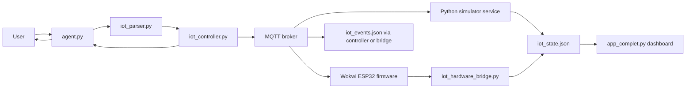
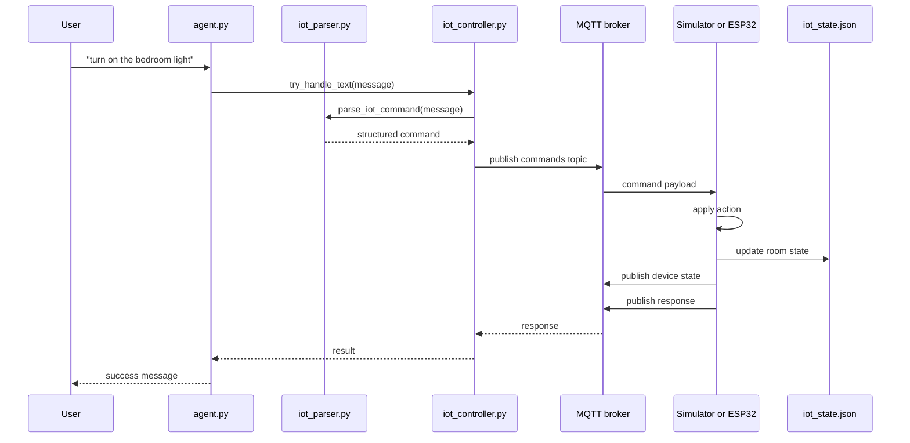
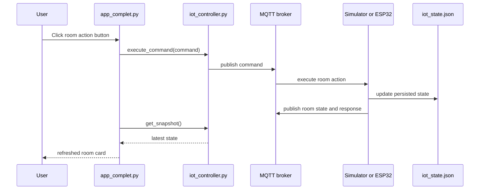
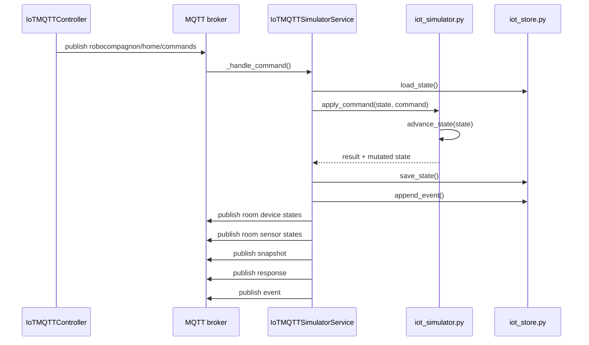
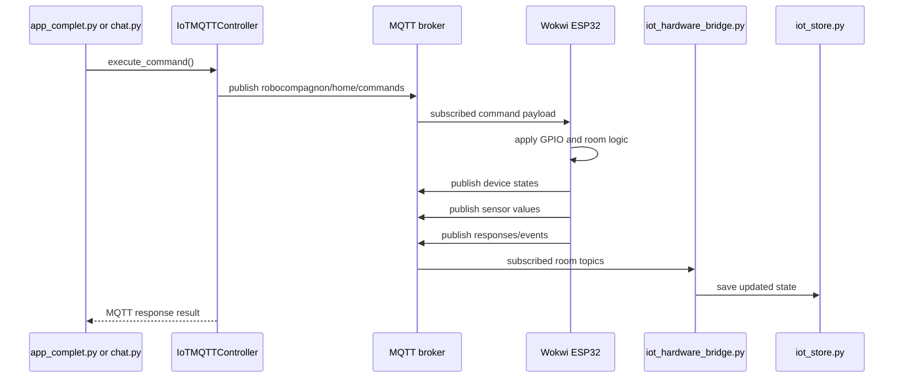
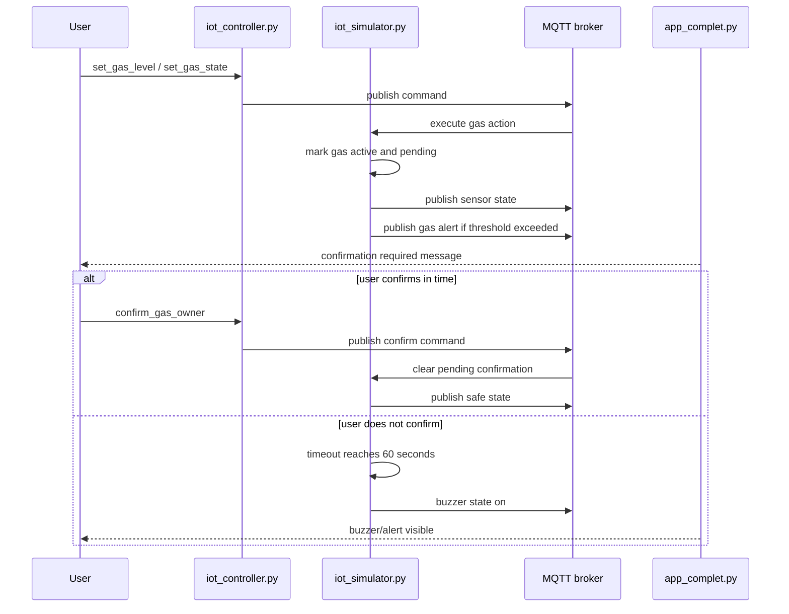

# RoboCompagnon Full Project Report

## Status
Current documented state as of 2026-05-07

## 1. Project Summary

RoboCompagnon is a simulation-first IoT smart home assistant. It lets a user control home devices with chat or dashboard actions, routes those requests through MQTT, updates a shared home state, and reflects the result in the UI.

The project is intentionally simple:
- local-first
- demo-ready
- room-based
- MQTT-driven
- easy to swap between simulator mode and Wokwi ESP32 hardware mode

This is not a production smart-home platform. It is a practical teaching and demo project for:
- lights
- AC
- door lock state
- gas detection
- room sensors
- simple local edge logic

## 2. Main Goals

The project exists to demonstrate a realistic small IoT workflow:

1. User sends a natural-language command.
2. The assistant detects whether it is an IoT request.
3. The parser converts text into a structured command.
4. The controller publishes that command through MQTT.
5. A simulator service or ESP32 node applies the action.
6. The new device and sensor states are published back to MQTT.
7. The persisted digital twin is updated.
8. The dashboard and chat read the new state.

## 3. Main Features

### Implemented user-facing features

- Turn room lights on and off
- Set light brightness
- Turn AC on and off
- Set AC target temperature
- Lock and unlock doors
- Read room temperature
- Read room humidity
- Read room light level
- Read room gas level
- Turn gas simulation on and off
- Set gas ppm manually
- Confirm user-owned gas action to avoid buzzer warning
- View room state in Streamlit dashboard
- View recent activity and alerts
- Run in simulator mode or hardware mode

### Simple safety behavior

- Gas alert when `gas_ppm > 400`
- Gas confirmation workflow
- Gas buzzer if gas stays active and unconfirmed for 60 seconds

## 4. Current Home Model

The current house contains four rooms:

- `living_room`
- `kitchen`
- `bedroom`
- `toilet`

### Room inventory

#### Living Room
- `light_main`
- `ac_main`
- `door_main`
- `buzzer_main`
- sensors: `temperature`, `humidity`, `occupancy`, `light_level`, `gas_ppm`

#### Kitchen
- `light_main`
- `buzzer_main`
- sensors: `temperature`, `humidity`, `occupancy`, `light_level`, `gas_ppm`

#### Bedroom
- `light_main`
- `ac_main`
- `door_main`
- `buzzer_main`
- sensors: `temperature`, `humidity`, `occupancy`, `light_level`

#### Toilet
- `light_main`
- `door_main`
- `buzzer_main`
- sensors: `temperature`, `humidity`, `occupancy`, `light_level`

## 5. Core Technologies And What They Do

### Python
Python is the main application language. It runs the assistant, parser, controller, simulator, dashboard, state persistence, and MQTT integration.

### MQTT
MQTT is the messaging layer between command senders and device logic.

It is used for:
- sending commands
- receiving execution responses
- publishing room device state
- publishing room sensor state
- publishing gas alerts
- keeping the UI synchronized

### Streamlit
Streamlit powers the dashboard in `app_complet.py`.

It is used for:
- room selection
- device controls
- sensor visualization
- event history
- alerts
- chat interaction

### JSON Persistence
The project stores state in local JSON files:
- `iot_state.json`
- `iot_events.json`

This keeps the system simple and easy to inspect manually.

### Wokwi ESP32
Wokwi is used as the hardware-mode simulator for ESP32 firmware.

It is used for:
- testing real MQTT message flow
- simulating GPIO-driven devices
- simulating sensors
- showing a hardware path without needing physical hardware

## 6. Key Files And Their Responsibilities

### Application and assistant

- `agent.py`
  Routes user requests and sends IoT requests to the controller when needed.

- `chat.py`
  CLI entry point for text-based interaction.

- `app_complet.py`
  Main Streamlit dashboard and chat UI.

### IoT core

- `iot_parser.py`
  Converts natural language into structured IoT commands.

- `iot_controller.py`
  Main MQTT controller. Publishes commands, receives responses, manages simulator mode and hardware mode, and republishes room state.

- `iot_simulator.py`
  Applies device actions and advances room physics over time.

- `iot_store.py`
  Loads, normalizes, saves, resets, and logs IoT state and events.

- `iot_hardware_bridge.py`
  Subscribes to hardware MQTT topics and syncs incoming device and sensor states into `iot_state.json`.

- `mqtt_client.py`
  MQTT client transport used with Mosquitto or a reachable broker.

- `mqtt_topics.py`
  Central topic constants and helper topic builders.

- `house_config.py`
  Source-of-truth room definitions, device defaults, sensors, and simulation layout metadata.

### Data files

- `iot_state.json`
  Current digital twin state for rooms, devices, sensors, alerts, and safety state.

- `iot_events.json`
  Recent event history.

### Hardware

- `firmware/wokwi/esp32-home-node/src/main.cpp`
  ESP32 firmware for MQTT command handling and state publishing in Wokwi.

## 7. State Model

The project uses a digital twin stored in `iot_state.json`.

Main top-level sections:
- `meta`
- `outside`
- `rooms`
- `alerts`
- `safety`

### `meta`
- `last_update`
- `transport`
- `version`

### `outside`
- `temperature`
- `humidity`
- `source`
- `updated_at`

### `rooms`
Each room contains:
- `name`
- `devices`
- `sensors`
- `environment`

### `alerts`
- `gas`
- `gas_unconfirmed`
- `gas_buzzer`

### `safety`
- `gas_confirmation.active`
- `gas_confirmation.pending`
- `gas_confirmation.armed_at`
- `gas_confirmation.confirmed`

## 8. Supported Command Types

The parser currently supports these main actions:

- `turn_on`
- `turn_off`
- `set_temperature`
- `set_brightness`
- `lock`
- `unlock`
- `get_sensor`
- `get_device_state`
- `set_gas_state`
- `set_gas_level`
- `confirm_gas_owner`

### Room resolution

If no room is detected, the parser defaults to `living_room`.

Examples of recognized room aliases:
- `living room`
- `kitchen`
- `bedroom`
- `toilet`
- `bathroom`
- `wc`

### Device resolution

Recognized device types:
- `light`
- `ac`
- `door`

### Sensor resolution

Recognized sensor types:
- `temperature`
- `humidity`
- `light_level`
- `gas_ppm`

## 9. MQTT Topics In Use

### Command and system topics

- `robocompagnon/home/commands`
- `robocompagnon/home/responses`
- `robocompagnon/home/events`
- `robocompagnon/home/snapshot`
- `robocompagnon/home/alerts/gas`

### Per-room device state pattern

- `robocompagnon/home/rooms/{room_id}/devices/{device_id}/state`

### Per-room sensor state pattern

- `robocompagnon/home/rooms/{room_id}/sensors/{sensor_name}`

### What they are used for

- `commands`: controller publishes structured commands
- `responses`: simulator or ESP32 publishes execution result
- `events`: execution history
- `snapshot`: full house state
- `alerts/gas`: gas leak alert publication
- room device topics: per-device UI sync
- room sensor topics: per-sensor UI sync

## 10. Runtime Modes

The system uses `IOT_MODE`.

### Simulator mode

Value:
- `IOT_MODE=simulator`

Behavior:
- Python owns device logic
- `IoTMQTTSimulatorService` subscribes to command topic
- `iot_simulator.py` mutates the digital twin
- Python republishes snapshot, room device, and room sensor topics on an interval

Use this mode when:
- testing quickly
- developing logic
- no hardware path is needed

### Hardware mode

Value:
- `IOT_MODE=hardware`

Behavior:
- Python still publishes commands
- Wokwi ESP32 firmware executes hardware-side logic
- `iot_hardware_bridge.py` listens to device and sensor topics
- bridge writes MQTT updates back into `iot_state.json`

Use this mode when:
- demonstrating ESP32 integration
- validating topic compatibility
- testing dashboard behavior against external MQTT publishers

## 11. Full End-To-End Flow

## 11.1 High-Level System Diagram

## 11.2 Natural-Language Command Sequence

## 11.3 Dashboard Button Sequence

## 12. Simulator Mode Internal Sequence

## 13. Hardware Mode Internal Sequence

## 14. Parser Logic

The parser is intentionally rule-based and simple.

### Main parser steps

1. Normalize the message.
2. Ignore weather-style messages.
3. Resolve room alias.
4. Resolve device type or sensor type.
5. Detect action pattern.
6. Extract parameters such as:
- brightness
- target temperature
- gas ppm
7. Return a structured command dictionary.

### Why this design is used

- easier to test
- safer than free-form execution
- easier to connect to hardware later
- avoids overengineering

## 15. Device Command Handling

`iot_simulator.py` owns state mutation in simulator mode.

### Light behavior

- `turn_on`: state becomes `on`
- `turn_off`: state becomes `off`
- `set_brightness`: brightness set between `0` and `100`
- brightness over `0` keeps the light `on`
- brightness affects `power_w`
- light state affects room `light_level`

### AC behavior

- `turn_on`: state becomes `on`
- `turn_off`: state becomes `off`
- `set_temperature`: target set between `16` and `30`
- AC affects room temperature gradually
- AC also lowers humidity slightly over time

### Door behavior

- `lock`: state becomes `locked`
- `unlock`: state becomes `unlocked`

### Gas behavior

- `set_gas_state`: turns simulated gas on or off
- `set_gas_level`: sets gas ppm between `0` and `1000`
- `confirm_gas_owner`: confirms that the user intentionally triggered gas and avoids buzzer escalation

## 16. Physics And Edge Logic

The simulator uses lightweight physics in `advance_state(state)`.

### Temperature factors

- outside temperature drift
- room insulation
- room sun exposure
- occupancy heat
- AC cooling

### Humidity factors

- outside humidity drift
- AC dehumidification

### Light-level factors

- daylight level based on hour
- artificial light boost based on light brightness

### Actual implemented daylight schedule

- `07:00-09:59` -> `420 lux`
- `10:00-15:59` -> `650 lux`
- `16:00-18:59` -> `360 lux`
- `19:00-21:59` -> `140 lux`
- night -> `40 lux`

### Gas safety logic

- `GAS_THRESHOLD = 400`
- any room above threshold sets `alerts.gas = true`
- gas confirmation is tracked in `safety.gas_confirmation`
- if gas remains active and pending long enough, buzzer becomes `on`
- `GAS_CONFIRMATION_TIMEOUT_S = 60`

## 17. Gas Alert And Confirmation Sequence

## 18. Weather Update Flow

The system can import outside weather data and apply it to the house state.

Sequence:

1. Weather data is fetched by the weather path.
2. `iot_controller.update_outside_weather()` receives it.
3. The current state is advanced first.
4. Outside temperature and humidity are updated.
5. Future room simulation steps drift from that new outside state.

This keeps indoor evolution tied to changing outdoor conditions.

## 19. Hardware Mapping

The project already documents real hardware references in `docs/hardware.md`. Current mapped components include:

- DHT22
- MQ-2 gas sensor
- PIR occupancy sensor
- LDR
- relay for light
- relay for AC
- SG90 servo for door lock
- buzzer
- ESP32

### Pin references used in docs

- DHT22 -> `GPIO4`
- MQ-2 analog -> `GPIO34`
- PIR -> `GPIO5`
- LDR -> `GPIO35`
- light output -> `GPIO26`
- AC output -> `GPIO27`
- door servo -> `GPIO18`
- buzzer -> `GPIO32`
- gas alert LED -> `GPIO33`

## 20. Wokwi Firmware Responsibilities

The ESP32 firmware in `firmware/wokwi/esp32-home-node/src/main.cpp` is responsible for:

- subscribing to command topic
- decoding structured JSON commands
- applying room device changes
- publishing room device state
- publishing room sensor values
- publishing gas alert
- publishing command response
- publishing event records

The current Wokwi setup is a demo-friendly simplified hardware implementation, not a full production firmware design.

## 21. Event Logging

Events are appended to `iot_events.json`.

An event typically includes:
- `timestamp`
- `source`
- `topic`
- `room`
- `action`
- `target`
- `status`
- `raw_text`
- `details`

The event log is used for:
- dashboard history
- debugging
- demo traceability
- verifying command execution

## 22. Dashboard Behavior

`app_complet.py` is the main visual control surface.

### Main dashboard responsibilities

- room switching
- showing overview cards
- showing device cards
- showing sensor cards
- showing gas alert state
- showing gas confirmation countdown state
- showing recent activity
- sending command actions
- refreshing from persisted snapshot

### Important UI rule

The dashboard is mainly a reader and command sender. It should not become the owner of device logic. The simulator service or hardware node remains the state authority.

## 23. Current Alert Model

The project currently has these alert-related state flags:

- `alerts.gas`
- `alerts.gas_unconfirmed`
- `alerts.gas_buzzer`

Meaning:
- `gas`: threshold exceeded
- `gas_unconfirmed`: gas action active and still waiting for confirmation
- `gas_buzzer`: timeout reached and buzzer alarm active

## 24. What Happens When

### When a user turns on a light

- parser resolves `turn_on`
- controller publishes command
- simulator or ESP32 updates `light_main`
- room state topic is published
- snapshot is updated
- dashboard reflects new light state

### When a user sets AC temperature

- parser extracts target temperature
- controller publishes command
- device state is updated immediately
- later simulation steps gradually cool the room
- dashboard shows both target and actual room temperature

### When gas level rises above threshold

- gas sensor or simulator value becomes greater than `400`
- `alerts.gas` becomes true
- gas alert topic is published
- dashboard shows alert
- if unconfirmed for 60 seconds, buzzer activates

### When hardware mode is active

- Python sends commands only
- external ESP32 is expected to perform the action
- hardware bridge updates local state from MQTT subscriptions

## 25. Current Limitations

- Not production-ready
- Local JSON persistence only
- Parser is intentionally simple and may miss complex phrasing
- Some docs describe earlier phases; this file consolidates the current behavior
- Hardware mode is still a demo path using Wokwi, not a full deployed device fleet
- Some rooms reuse simplified or shared simulated hardware behavior
- Occupancy remains simple and is not yet a full spoken-command feature
- No complex scheduling or cloud automation
- No advanced authentication or security model

## 26. Why The Project Is Structured This Way

The structure follows the project rule to avoid overengineering.

That is why it uses:
- a single Python codebase
- simple room and device dictionaries
- JSON persistence
- MQTT for realistic message flow
- a small parser instead of a complex intent engine
- a simulator-first design with a clean hardware swap path

This keeps the project:
- understandable
- buildable
- easy to demo
- easy to extend carefully

## 27. Recommended Reading Order In `/docs`

For a new developer, read the docs in this order:

1. `docs/project-full-report.md`
2. `docs/architecture.md`
3. `docs/mqtt-topics.md`
4. `docs/hardware.md`
5. `docs/robot-workflow-diagrams.md`
6. `docs/sensor-diagrams.md`
7. `docs/wokwi-simulation.md`
8. `docs/task-log.md`

## 28. Final Summary

RoboCompagnon is a small smart-home assistant and IoT simulator built around a digital twin of a four-room house.

It uses:
- Python for logic
- MQTT for transport
- Streamlit for UI
- JSON for persistence
- Wokwi ESP32 for a hardware-like demo path

It works by:
- parsing commands
- publishing MQTT messages
- applying device or sensor logic
- persisting the new state
- publishing updates
- showing the result in chat and dashboard

Its most important engineering idea is simple:

The UI and assistant send requests and read state, but the actual device authority belongs to the simulator service or the hardware node.
