# Robot Workflow And Sensor Control

This document explains how the robot assistant handles commands, how sensors produce data, and how actuators are controlled.

The project stays simple on purpose:
- The robot assistant parses the user command.
- MQTT carries the command or sensor update.
- The simulator or ESP32 applies the change.
- The shared state file and dashboard show the result.

---

## 1. Global Workflow

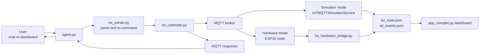

### Simple Explanation
1. The user sends a command such as `turn on the light`.
2. `agent.py` sends the text to `iot_parser.py`.
3. The parser creates a structured command like `turn_on` for device `light`.
4. `iot_controller.py` publishes that command to MQTT.
5. The command is executed by either the Python simulator or the ESP32 node.
6. The new state is published back through MQTT.
7. The state is saved and shown in the dashboard.
8. The robot returns a final message to the user.

---

## 2. Command Control Flow

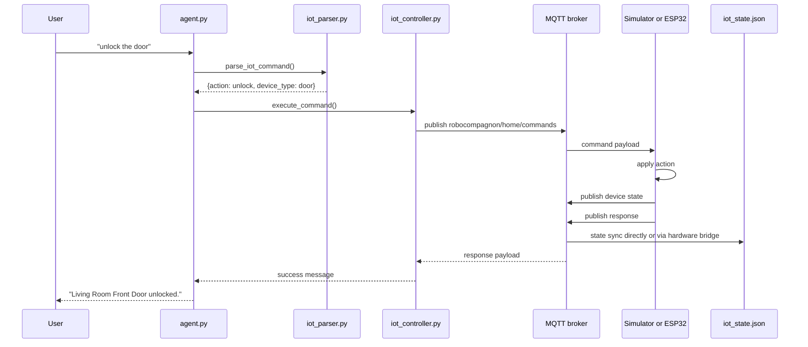

---

## 3. Robot Control Map

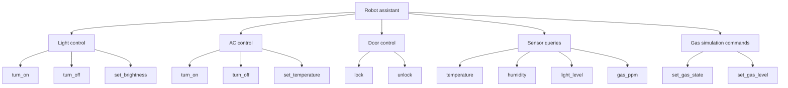

---

## 4. Sensor And Actuator Relationships

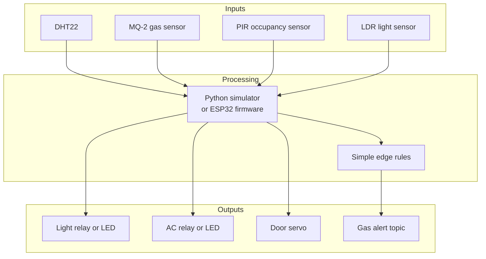

---

## 5. Sensor Workflow

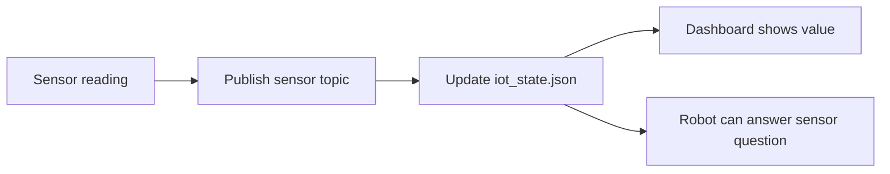

### Sensor Topics In Use
- `robocompagnon/home/rooms/living_room/sensors/temperature`
- `robocompagnon/home/rooms/living_room/sensors/humidity`
- `robocompagnon/home/rooms/living_room/sensors/occupancy`
- `robocompagnon/home/rooms/living_room/sensors/light_level`
- `robocompagnon/home/rooms/living_room/sensors/gas_ppm`
- `robocompagnon/home/alerts/gas`

---

## 6. Temperature And Humidity Sensor

### What It Does
- The DHT22 measures room temperature and humidity on real hardware.
- In simulator mode, `iot_simulator.py` computes these values from room physics.

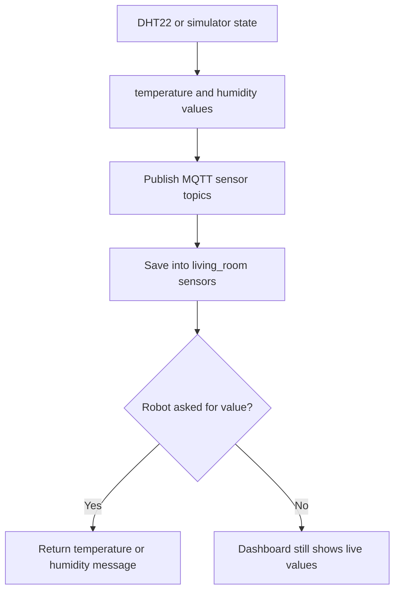

### How The Robot Uses It
- Temperature helps the robot report room conditions.
- Temperature also works with AC control logic.
- Humidity is reported to the user and updated over time.

---

## 7. Light Sensor

### What It Does
- The LDR measures ambient light on hardware.
- In simulator mode, light level is calculated from time of day and light brightness.

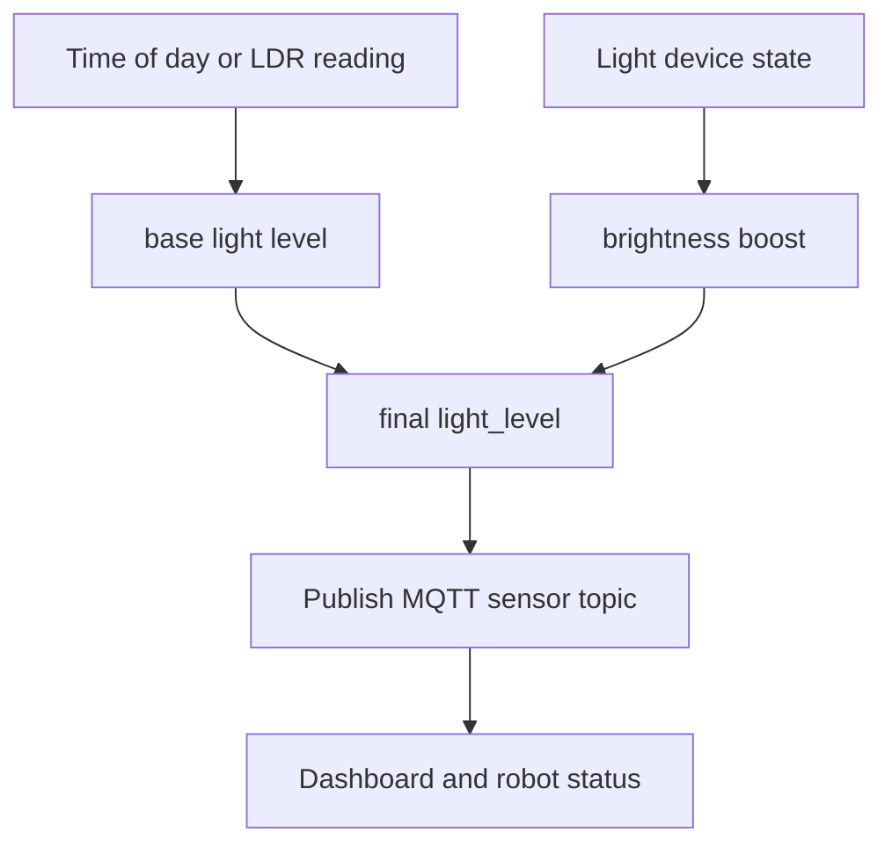

### How The Robot Uses It
- The robot answers `what is the light level?`
- The light actuator changes this sensor indirectly when the light turns on.

---

## 8. Gas Sensor And Alert Rule

### What It Does
- The MQ-2 sensor reads gas concentration in ppm.
- The robot can also simulate gas by command.
- If gas is above `400 ppm`, the system raises an alert.

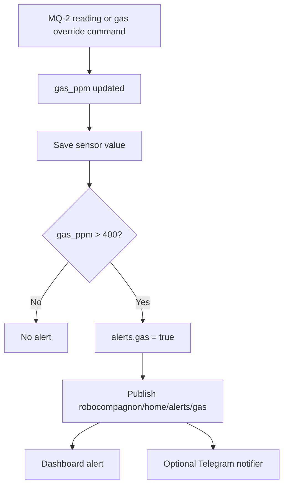

### How The Robot Uses It
- The robot answers `what is the gas level?`
- The robot accepts commands such as `turn gas on`, `turn gas off`, and `set gas level to 300 ppm`.

---

## 9. Occupancy Sensor

### What It Does
- The PIR sensor detects motion on hardware.
- In the current simulator, occupancy is stored as a simple boolean.

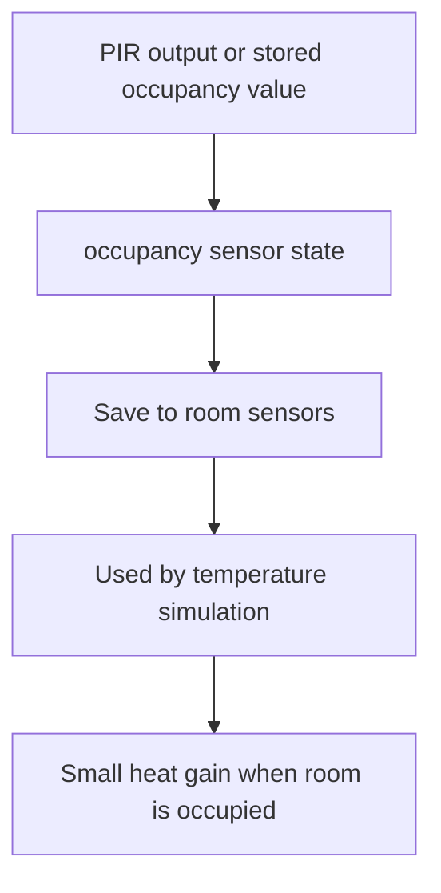

### How The Robot Uses It
- Occupancy affects temperature simulation.
- The dashboard displays occupancy status.
- It is not yet a main spoken command feature.

---

## 10. Actuator Control

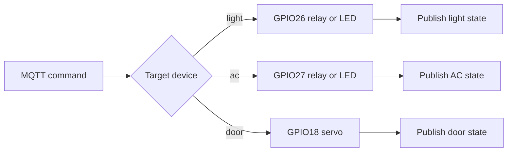

### Device Details
- Light:
The robot sends ON, OFF, or brightness commands. The light state also affects `light_level`.
- AC:
The robot sends ON, OFF, or target temperature commands. The AC affects `temperature` and `humidity`.
- Door:
The robot sends `lock` or `unlock`. On hardware, the servo moves between lock positions.

---

## 11. Simulator Mode Vs Hardware Mode

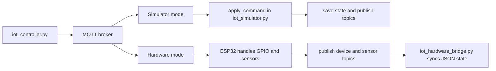

### Practical Difference
- Simulator mode:
Python owns both device logic and sensor evolution.
- Hardware mode:
ESP32 owns the real pins and real sensor reads, while Python only syncs and displays the result.

---

## 12. Current Hardware List

- DHT22 on `GPIO4`
- MQ-2 gas sensor on `GPIO34`
- PIR occupancy sensor on `GPIO5`
- LDR on `GPIO35`
- Light output on `GPIO26`
- AC output on `GPIO27`
- Door servo on `GPIO18`

---

## 13. Summary

The robot does not control sensors directly. It controls actuators and reads sensor data through MQTT.

The main behavior is:
1. Parse command.
2. Publish MQTT message.
3. Simulator or ESP32 executes it.
4. Sensor and device state are published back.
5. JSON state and dashboard refresh.
6. The robot answers with a simple result.
