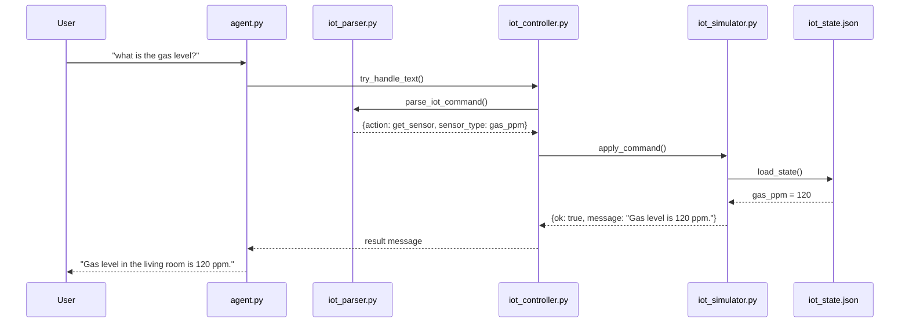
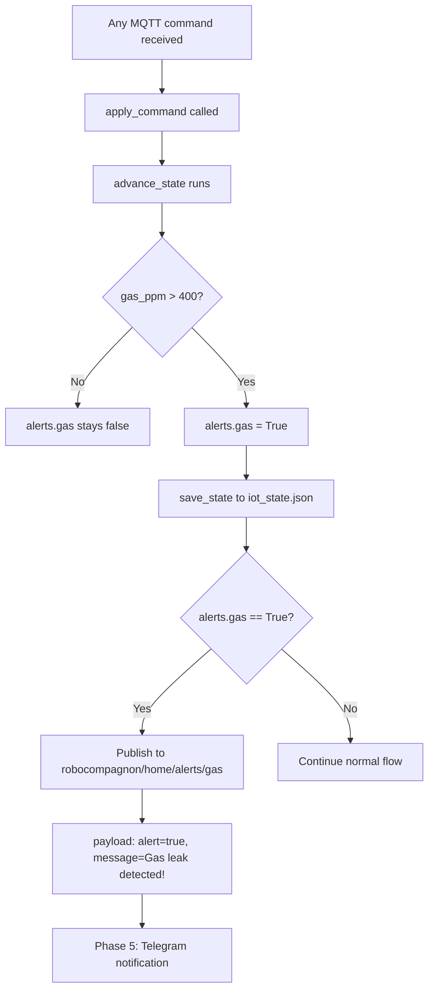
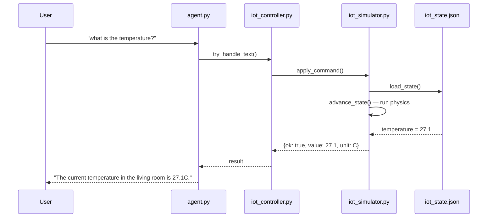
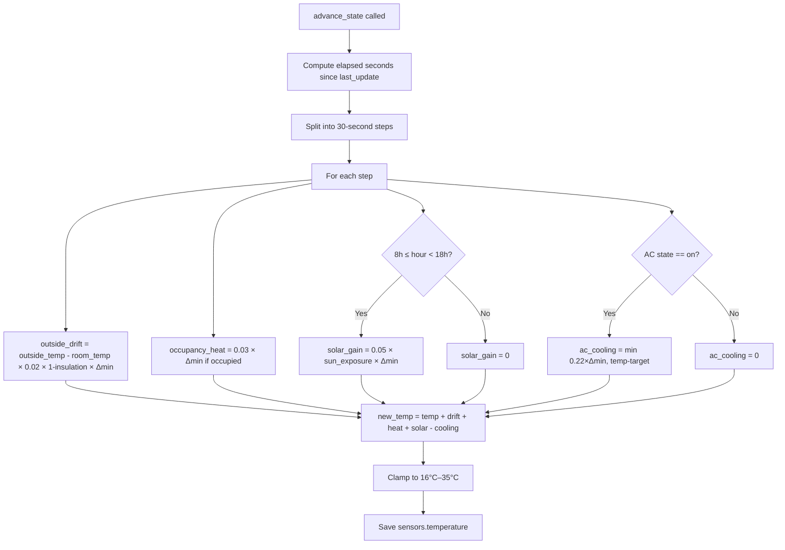
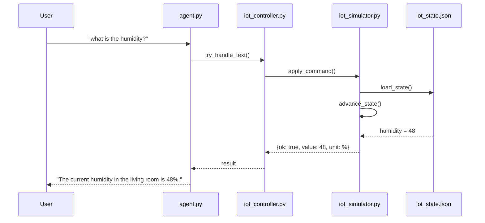
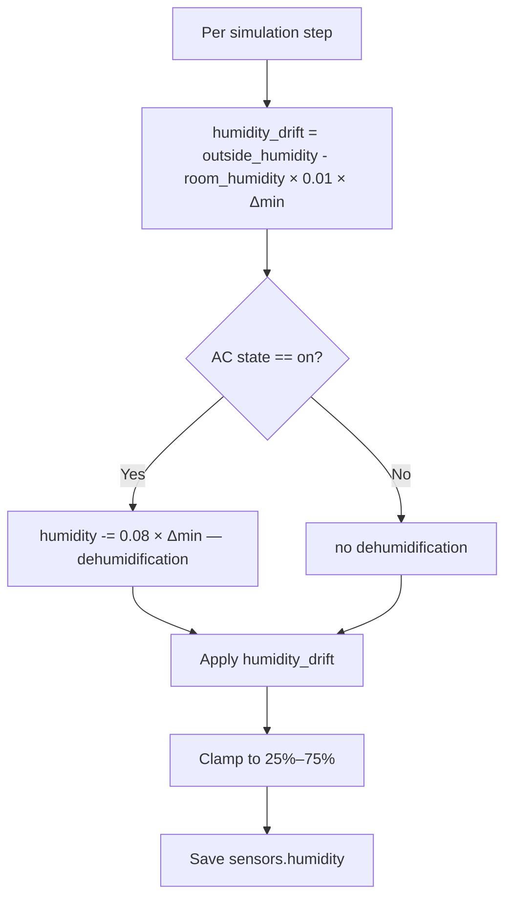
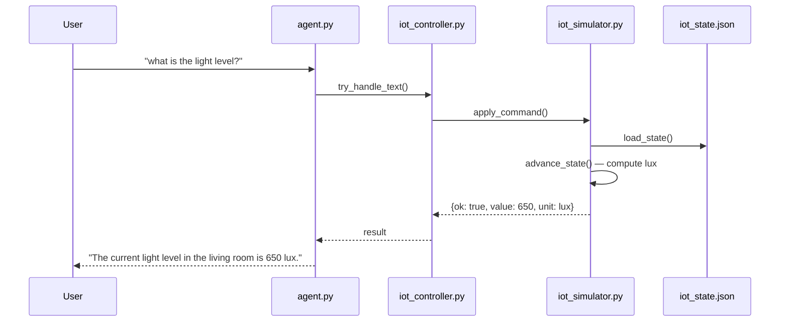
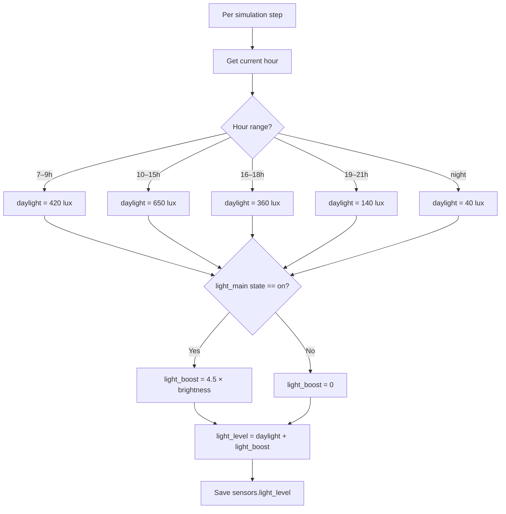
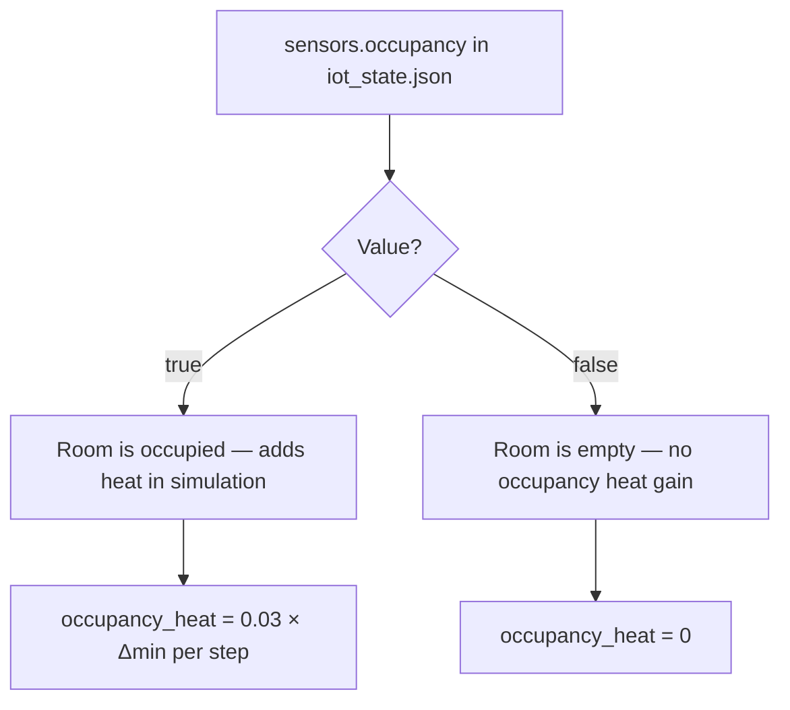
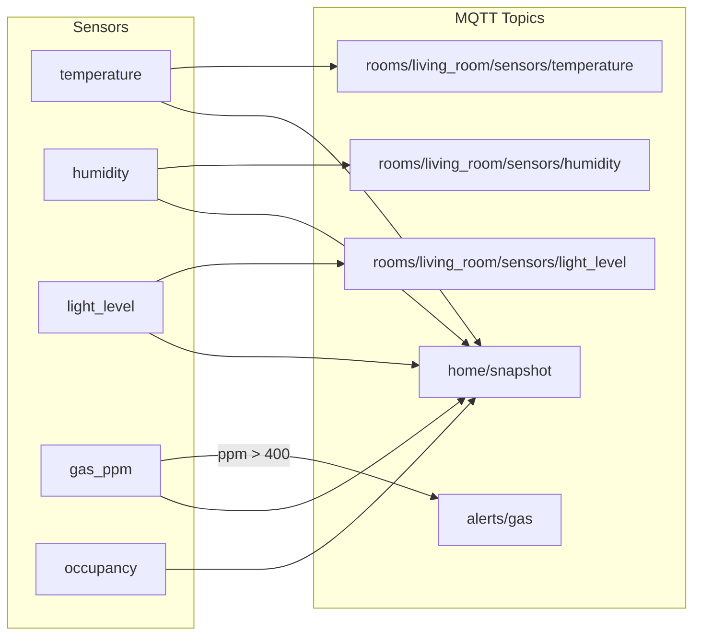

# Sensor Feature Diagrams

Mermaid diagrams for all implemented sensor features (Phase 1 + Phase 2).

---

## 1. Gas Detection

### Query Flow ("what is the gas level?")

### Edge Alert Flow (automatic, threshold-triggered)

---

## 2. Temperature Sensor

### Query Flow ("what is the temperature?")

### Physics Simulation (advance_state)

---

## 3. Humidity Sensor

### Query Flow ("what is the humidity?")

### Humidity Physics

---

## 4. Light Level Sensor

### Query Flow ("what is the light level?")

### Light Level Computation

---

## 5. Occupancy Sensor

### Query via State

> **Note:** Occupancy is a static boolean set manually in `iot_state.json`. Auto-detection via HC-SR501 PIR sensor is planned for real hardware (GPIO5). No NL query command implemented yet.

---

## Summary: Sensor → MQTT Topic Map

